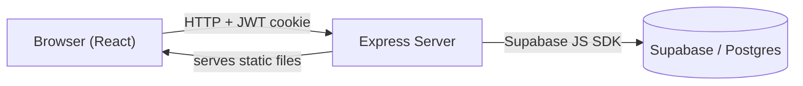
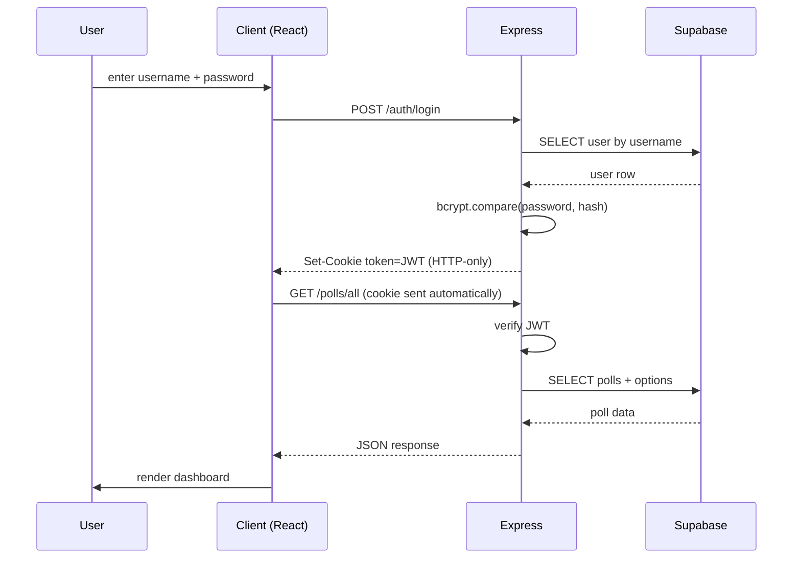

# Polls — UCLA Polling App

A web app where UCLA students can create polls, vote on each other's polls, and see results update in real time. 

## Quick start (Run the Express server)

1. Install dependencies:
	```bash
	npm install
	```
2. Create a `.env` file with the shared Supabase credentials:
	```env
	SUPABASE_URL=your-supabase-project-url
	SUPABASE_SECRET_KEY=your-supabase-secret-key
	JWT_SECRET=your-random-jwt-secret
	```
3. Start the server:
	```bash
	npm start
	```
4. Open http://localhost:3000 in your browser.

For a full setup walkthrough (including creating the Supabase project and schema), see [Running locally](#running-locally) below.

## Features

- **Authentication** — Sign up, log in, and log out with secure JWT-based sessions stored in HTTP-only cookies. Passwords are hashed with bcrypt.
- **Create polls** — Any logged-in user can create a poll with a question, multiple options, and a category (Food, Location, or Opinion).
- **Vote** — Click an option to vote. Click again to remove your vote. One vote per user per poll.
- **Live results** — Each poll displays a horizontal bar chart of vote counts that updates immediately after voting.
- **Search** — Search polls by question text.
- **Filter by category** — Pill-shaped category chips filter the poll list (All / Food / Location / Opinion).
- **View modes** — Tabs to switch between All polls, Mine (polls you created), and Voted (polls you've voted on).
- **Delete your own polls** — Poll creators can delete their polls; voting records cascade automatically.

## Tech stack

| Layer | Technology |
|---|---|
| Frontend | React 18 (via CDN with Babel Standalone) |
| Backend | Node.js + Express |
| Database | Supabase (hosted PostgreSQL) |
| Auth | JWT in HTTP-only cookies, bcrypt password hashing |
| Testing | Playwright (end-to-end) |

## Architecture

### System overview


The frontend is a set of static HTML pages served by Express. Each page loads a React component over CDN that talks to the Express API via `fetch`. Express verifies the JWT cookie on protected routes and proxies all data operations to Supabase.

### Auth flow


## Prerequisites

- **Node.js** v18 or higher
- A free **Supabase** account (https://supabase.com)
- npm (comes with Node.js)

## Running locally

### 1. Clone the repo
```bash
git clone https://github.com/AaronFan5/CS35L-Project.git
cd CS35L-Project
```

### 2. Set up Supabase
1. Create a new project at https://supabase.com
2. Open the **SQL Editor** in the Supabase dashboard
3. Paste and run the contents of [`supabase/schema.sql`](supabase/schema.sql) — this creates the `users`, `polls`, `poll_options`, and `votes` tables
4. Go to **Settings → API** and copy your **Project URL** and your **service_role secret key**

### 3. Create `.env`
In the project root, create a file named `.env` with:
```env
SUPABASE_URL=your-supabase-project-url
SUPABASE_SECRET_KEY=your-supabase-service-role-key
JWT_SECRET=any-long-random-string-you-pick
```
The `JWT_SECRET` is used to sign session tokens — pick any random string.

### 4. Install dependencies
```bash
npm install
```

### 5. Start the server
```bash
npm start
```
Open http://localhost:3000 in your browser.

## Running the tests

The project includes automated end-to-end tests using Playwright. To run them:

```bash
npx playwright install   # one-time browser install
npm test
```

The test suite covers:
1. **Auth flow** — sign up a new user, log in, and reach the dashboard
2. **Poll lifecycle** — create a poll, vote on it, verify the vote count updates

## Project structure

```
CS35L-Project/
├── server.js                 # Express entry point
├── routes/
│   ├── auth.js               # /auth/login, /auth/signup, /auth/me, /auth/logout
│   ├── polls.js              # /polls/all, /polls/create, /polls/vote, /polls/:id
│   └── dashboard.js          # serves dashboard.html
├── middleware/
│   └── authMiddleware.js     # JWT verification (requireAuth)
├── services/
│   ├── supabaseClient.js     # Supabase SDK initialization
│   └── pollService.js        # poll CRUD + vote business logic
├── public/
│   ├── index.html            # landing page
│   ├── login.html            # login shell (loads auth.js)
│   ├── signup.html           # signup shell (loads auth.js)
│   ├── dashboard.html        # dashboard shell (loads dashboard.js)
│   ├── styles.css            # design system
│   └── js/
│       ├── auth.js           # React auth form
│       └── dashboard.js      # React dashboard
├── supabase/
│   └── schema.sql            # database schema
└── tests/
    └── e2e.spec.js           # Playwright tests
```

## API reference

| Method | Path | Auth | Description |
|---|---|---|---|
| `POST` | `/auth/signup` | No | Create a new user, returns Set-Cookie |
| `POST` | `/auth/login` | No | Log in, returns Set-Cookie |
| `POST` | `/auth/logout` | No | Clear the auth cookie |
| `GET` | `/auth/me` | Yes | Return current user's username |
| `GET` | `/polls/all` | No | List all polls with options and vote counts |
| `GET` | `/polls/user-votes` | Yes | Return current user's votes |
| `POST` | `/polls/create` | Yes | Create a poll. Body: `{ question, options[], category }` |
| `POST` | `/polls/vote` | Yes | Cast/remove a vote. Body: `{ pollId, optionIndex }` |
| `DELETE` | `/polls/:id` | Yes | Delete a poll (creator only) |
