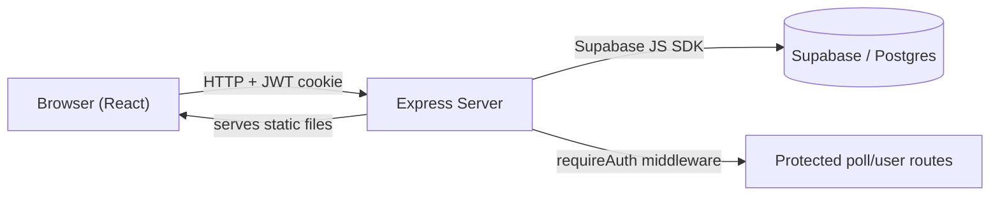
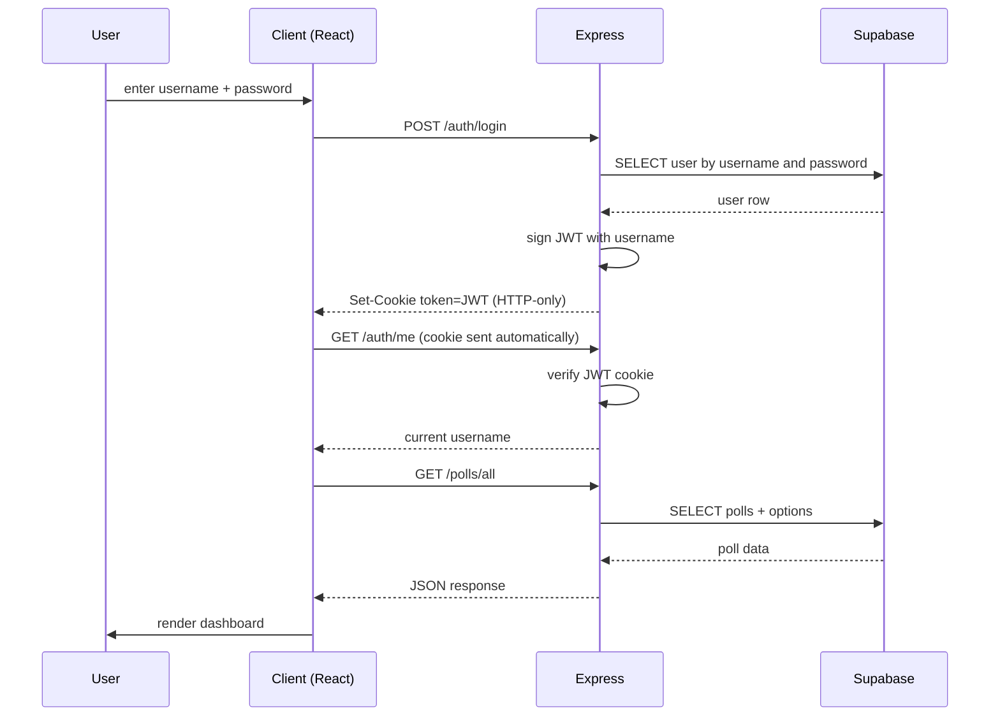

# Polls — UCLA Polling App

A web app where UCLA students can create polls, vote on each other's polls, and see results update in real time. 

## Quick start (Run the Express server)

1. Install dependencies:
	```bash
	npm install
	```
2. Create a `.env` file with the shared Supabase credentials:
	```env
	SUPABASE_URL=your-supabase-project-url
	SUPABASE_SECRET_KEY=your-supabase-secret-key
	JWT_SECRET=your-random-jwt-secret
	```
3. Start the server:
	```bash
	npm start
	```
4. Open http://localhost:3000 in your browser.

For a full setup walkthrough (including creating the Supabase project and schema), see [Running locally](#running-locally) below.

## Features

- **Authentication** — Sign up, log in, and log out with JWT-based sessions stored in HTTP-only cookies. Authenticated routes protect poll creation, voting, user follows, and account-specific dashboard data.
- **Create polls** — Any logged-in user can create a poll with a question, multiple options, category, voting type, and optional timer.
- **Vote** — Users can vote in single-choice, multiple-choice, and ranked-choice polls. Single-choice votes can be changed or removed, multiple-choice votes can be toggled, and ranked polls store ranked selections.
- **Live results** — Each poll displays a horizontal bar chart with vote counts and percentages after voting.
- **Search** — Search polls by question text and search users by username.
- **Filter by category** — Pill-shaped category chips filter the poll list (All / Food / Location / Opinion).
- **View modes** — Tabs switch between All polls, Following, Mine (polls you created), and Voted (polls you've voted on).
- **Follow users** — Search for users, follow/unfollow them, and view polls from followed users in a dedicated feed.
- **Poll status controls** — Poll creators can close, reopen, and delete their own polls. Voting records cascade automatically when a poll is deleted.
- **Timed polls** — Poll creators can set polls to close automatically after 10 minutes, 1 hour, 6 hours, or 1 day.

## Tech stack

| Layer | Technology |
|---|---|
| Frontend | React 18 (via CDN with Babel Standalone) |
| Backend | Node.js + Express |
| Database | Supabase (hosted PostgreSQL) |
| Auth | JWT in HTTP-only cookies |
| Testing | Playwright (end-to-end) |

## Architecture

### System overview


The frontend is a set of static HTML pages served by Express. Each page loads a React component over CDN that talks to the Express API via `fetch`. Express verifies the JWT cookie on protected routes and proxies data operations to Supabase. Supabase stores users, follow relationships, polls, poll options, votes, ranked choices, poll status, and timers.

### Auth flow


## Prerequisites

- **Node.js** v18 or higher
- A free **Supabase** account (https://supabase.com)
- npm (comes with Node.js)

## Running locally

### 1. Clone the repo
```bash
git clone https://github.com/AaronFan5/CS35L-Project.git
cd CS35L-Project
```

### 2. Set up Supabase
1. Create a new project at https://supabase.com
2. Open the **SQL Editor** in the Supabase dashboard
3. Paste and run the contents of [`supabase/schema.sql`](supabase/schema.sql) — this creates the `users`, `follows`, `polls`, `poll_options`, and `votes` tables
4. Go to **Settings → API** and copy your **Project URL** and your **service_role secret key**

### 3. Create `.env`
In the project root, create a file named `.env` with:
```env
SUPABASE_URL=your-supabase-project-url
SUPABASE_SECRET_KEY=your-supabase-service-role-key
JWT_SECRET=any-long-random-string-you-pick
```
The `JWT_SECRET` is used to sign session tokens — pick any random string.

### 4. Install dependencies
```bash
npm install
```

### 5. Start the server
```bash
npm start
```
Open http://localhost:3000 in your browser.

## Running the tests

The project includes automated end-to-end tests using Playwright. To run them:

```bash
npx playwright install chromium   # one-time browser install
npm test
```

To watch the browser while tests run:

```bash
npm run test:headed
```

The test suite covers:
1. **Auth flow** — sign up a new user, log in, and reach the dashboard
2. **Poll lifecycle** — create a poll, vote on it, verify the vote count updates
3. **Following flow** — follow another user and verify their poll appears in the Following feed
4. **Search flow** — search polls by question text and verify the visible results update

The tests create unique usernames and poll questions on each run so they can be run repeatedly against the same Supabase project.

## Project structure

```
CS35L-Project/
├── server.js                 # Express entry point
├── routes/
│   ├── auth.js               # /auth/login, /auth/signup, /auth/me, /auth/logout
│   ├── polls.js              # /polls/all, /polls/create, /polls/vote, /polls/:id
│   ├── users.js              # /users/search and follow/unfollow routes
│   └── dashboard.js          # serves dashboard.html
├── middleware/
│   └── authMiddleware.js     # JWT verification (requireAuth)
├── services/
│   ├── followService.js      # user search and follow relationships
│   ├── supabaseClient.js     # Supabase SDK initialization
│   └── pollService.js        # poll CRUD + vote business logic
├── validators/
│   └── pollValidator.js      # server-side poll and vote validation
├── public/
│   ├── index.html            # landing page
│   ├── login.html            # login shell (loads auth.js)
│   ├── signup.html           # signup shell (loads auth.js)
│   ├── dashboard.html        # dashboard shell (loads dashboard.js)
│   ├── styles.css            # design system
│   └── js/
│       ├── auth.js           # React auth form
│       └── dashboard.js      # React dashboard
├── supabase/
│   └── schema.sql            # database schema
├── playwright.config.js      # Playwright browser/server configuration
└── tests/
    └── e2e.spec.js           # Playwright tests
```

## API reference

| Method | Path | Auth | Description |
|---|---|---|---|
| `POST` | `/auth/signup` | No | Create a new user, returns Set-Cookie |
| `POST` | `/auth/login` | No | Log in, returns Set-Cookie |
| `POST` | `/auth/logout` | No | Clear the auth cookie |
| `GET` | `/auth/me` | Yes | Return current user's username |
| `GET` | `/polls/all` | No | List all polls with options and vote counts |
| `GET` | `/polls/user-votes` | Yes | Return current user's votes |
| `POST` | `/polls/create` | Yes | Create a poll. Body: `{ question, options[], category, votingType, maxChoices, closeAfterMinutes }` |
| `POST` | `/polls/vote` | Yes | Cast/remove a single or multiple-choice vote. Body: `{ pollId, optionIndex }`; ranked polls use `{ pollId, rankedChoices[] }` |
| `POST` | `/polls/toggle-status` | Yes | Close or reopen a poll owned by the current user |
| `DELETE` | `/polls/:id` | Yes | Delete a poll (creator only) |
| `GET` | `/users/me/following` | Yes | Return usernames followed by the current user |
| `GET` | `/users/search?q=...` | Yes | Search users by username |
| `POST` | `/users/:username/follow` | Yes | Follow a user |
| `DELETE` | `/users/:username/follow` | Yes | Unfollow a user |

## Security notes

The app requires authentication for creating polls, voting, following users, reading the current user's votes, and changing owned polls. Sessions are represented by signed JWTs stored in HTTP-only cookies.

Passwords are currently stored directly in the `users.password` column and compared during login. For production use, this should be changed to password hashing with a library such as bcrypt.
